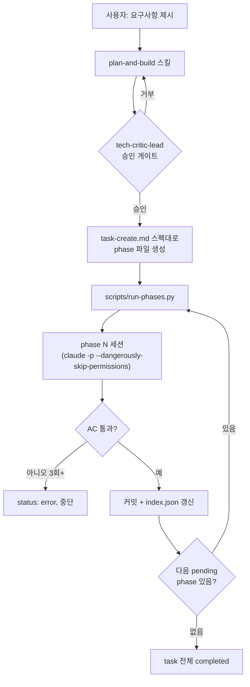

# Peekpop

폰 화면에 인물 사진이 떠 있는 사진을 넣으면, 그 인물이 화면 밖으로 튀어나온 것처럼 보이게 합성해주는 iOS 앱. 무계정·무서버·완전 온디바이스(Apple Vision 프레임워크)로 동작한다.

- 요구사항/설계: [`docs/prd.md`](docs/prd.md), [`docs/flow.md`](docs/flow.md), [`docs/code-architecture.md`](docs/code-architecture.md)
- 기술적 의사결정과 그 근거: [`docs/ade.md`](docs/ade.md)
- 빌드: `xcodegen generate && xcodebuild -project Peekpop.xcodeproj -scheme Peekpop -sdk iphonesimulator -destination 'platform=iOS Simulator,name=iPhone 17' build`
- 테스트: 위 커맨드의 `build`를 `test`로. (`SubjectSegmenter` 관련 4케이스는 Neural Engine이 필요해 시뮬레이터에서 자동 스킵됨 — [`docs/ade.md`](docs/ade.md) 참고)

이 문서는 앱 자체보다, **이 저장소를 만드는 데 쓴 커스텀 Claude Code 하네스**를 설명하는 데 집중한다.

---

## 왜 하네스를 직접 설계했나

Claude Code를 그냥 대화형으로 쓰는 대신, **요구사항 → 승인 게이트 → 계획 생성 → 자동 실행**까지 이어지는 파이프라인을 직접 설계해서 이 프로젝트 전체를 만들었다. AI가 무엇을 자율적으로 판단하게 두고, 어디에 강제 규칙을 박아넣고, 실패를 어떻게 감지·복구하게 할지를 전부 직접 설계했다.

## 구성 요소

| 파일 | 역할 |
|---|---|
| `~/.claude/skills/plan-and-build/SKILL.md` *(개인 스킬, 이 저장소 밖)* | 전체 절차를 정의하는 진입점. `/plan-and-build`로 트리거. |
| `tech-critic-lead` 서브에이전트 *(개인 에이전트, 이 저장소 밖)* | "기능은 비용이다"를 전제로 요구사항을 심사하는 승인 게이트. |
| [`prompts/task-create.md`](prompts/task-create.md) | 승인된 계획을 `tasks/{id}-{name}/phase{N}.md` 파일들로 변환하는 스펙. |
| [`scripts/run-phases.py`](scripts/run-phases.py) | phase를 하나씩 순차 실행하는 러너. |
| [`tasks/0-mvp-v0/`](tasks/0-mvp-v0) | 실제로 생성된 12개 phase 파일과 그 실행 결과(`phase{N}-output.json`). |

## 1. 승인 게이트 — `tech-critic-lead`

모든 신규 요구사항은 구현에 들어가기 전에 `tech-critic-lead`라는 "비판적 스타트업 CTO" 페르소나 서브에이전트에게 결재를 받는다. 판정 순서는 고정돼 있다 — 하나라도 걸리면 거부:

1. 증거가 있는가 (실제 근거 vs 추정)
2. 더 싼 대안은 없는가
3. CLI+AI로 완결 가능한가 (사람 개입 최소화)
4. 지금 당장 필요한가
5. MVP scope(티켓 한 장 수준)인가

**실제로 이렇게 동작했다**: 8화면짜리 풀 프로덕션 버전을 바로 만들겠다고 제안했다가 "증거 없음 + 스코프 과대"로 1차 거부당했다. 대응은 세 가지였다 — CLI로 실제 시장조사를 수행해 증거를 보강하고(경쟁 서비스 존재 자체를 수요의 증거로 재해석), 스코프를 8화면 → 5화면으로 줄이고(온보딩 캐러셀·브러시 보정 UI를 다음 버전으로 연기), 품질 안전장치(degenerate 결과 재시도 유도)만 남겼다. 재제안 후 조건부 승인이 나왔다. 이 논의 전체는 사용자에게 묻지 않고 에이전트 대 에이전트로 진행됐다 — 스킬 지침에 "절대 사용자에게 의견을 묻지 말 것"이 명시돼 있다.

## 2. 계획을 실행 단위로 쪼개기 — `task-create.md`

승인된 계획은 `prompts/task-create.md` 스펙에 따라 `tasks/{id}-{name}/phase{N}.md` 파일들로 쪼개진다. 핵심 원칙은 **자기완결성**이다 — 각 phase 파일은 독립된 Claude 세션이 그 파일 하나만 읽고 작업을 완수할 수 있어야 한다. "이전 대화에서 논의한 바와 같이" 같은 암묵적 참조는 금지되고, 필요한 문서 경로·이전 phase 산출물 경로·Acceptance Criteria(실행 가능한 커맨드)가 전부 파일 안에 명시된다.

Phase 0는 항상 문서 업데이트 전용이다 — 구현이 시작되기 전에 설계 문서가 먼저 갱신되고, 그 diff(`docs-diff.md`)가 이후 phase들의 "사전 준비" 자료로 참조된다.

## 3. 순차 자동 실행 — `run-phases.py`

`python3 scripts/run-phases.py 0-mvp-v0`를 실행하면:

1. `feat-mvp-v0` 브랜치를 자동 생성/체크아웃한다 — **main은 절대 직접 건드리지 않는다.**
2. 다음 `pending` phase의 `.md` 파일 내용을 공통 프리앰블과 합쳐 프롬프트를 구성한다.
3. `claude -p --dangerously-skip-permissions --output-format json`으로 완전히 독립된 세션을 스폰한다.
4. 그 세션이 AC를 직접 검증하고 `index.json`의 상태를 갱신할 것을 기대한다 — 러너는 그 결과를 다시 읽어 확인할 뿐, 스스로 성공/실패를 판단하지 않는다.
5. phase 완료 시 2단계로 커밋한다: ① 세션이 직접 커밋하지 않은 변경분에 대한 fallback 커밋, ② `phase{N}-output.json`과 타임스탬프만 담는 러너 자체의 housekeeping 커밋.
6. 실패하거나(AC 미통과), 세션이 상태를 아예 갱신하지 않고 끝나면 즉시 중단한다. 재실행 시 해당 phase만 다시 돈다.

전체 phase가 끝나도 자동으로 `main`에 merge하지 않는다 — 사람이 diff를 검토하고 직접 merge하는 지점을 의도적으로 남겨뒀다.

### 실행 주체를 누구로 할 것인가

원래는 이 세션이 서브에이전트로 각 phase를 대신 실행하려 했다. 그런데 Claude Code의 자동 모드 안전 분류기가 `--dangerously-skip-permissions`로 무제한 세션을 연속 스폰하는 패턴을 위험 작업으로 차단했다. 여기서 내린 판단은 "막힌 걸 우회하지 말고, 애초에 하네스 엔지니어링이 목적이면 이건 내가 내 터미널에서 직접 돌리는 게 더 정확한 학습"이라는 것 — 그래서 `run-phases.py`는 사용자가 자기 터미널에서 직접 실행했다. 이건 우회가 아니라 **하네스의 실행 권한 경계를 의도적으로 사용자 쪽에 둔 설계 선택**이다.

## 실행 중 실제로 만난 버그들

하네스를 만들고 돌리는 과정 자체에서 발견/수정한 문제들 (자세한 내용은 [`docs/ade.md`](docs/ade.md)):

- **`KeyError` 크래시**: 프리앰블 생성에 `str.format()`을 썼는데, 커밋 메시지 예시 문구 안의 `{task_name}` 같은 리터럴 중괄호를 실제 플레이스홀더로 오인해 크래시. f-string 기반으로 재작성해 해결.
- **"nothing to commit" 크래시**: 무관한 로컬 툴링 상태 디렉터리(`.omc/`)가 실수로 커밋된 뒤 계속 변경되면서, `git status --porcelain` 기반의 "dirty repo" 판정이 항상 참이 됨 → 커밋 로직이 staged 변경 유무(`git diff --cached --quiet`)만 확인하도록 전환.
- **Xcode GUI 의존성**: 원래 Phase 1이 "File → New → Project"를 전제로 했는데, 무인 세션은 GUI를 조작할 수 없다 → `xcodegen` + `project.yml`로 완전히 CLI화.

## 프로젝트 히스토리 전체

`tasks/0-mvp-v0/`에 실제로 생성된 12개 phase 파일과 각 phase의 실행 로그(`phase{N}-output.json`)가 그대로 남아 있다. 이후 실기기 QA와 디자인 리뷰를 거치며 반영된 변경들은 git 커밋 히스토리와 [`docs/ade.md`](docs/ade.md)에 결정 근거와 함께 기록돼 있다.
